# RectangleMappingTool
RectangleMappingTool is a dedicated rectangle plotting and coordinate exporting tool. It is built on PyQt5 and packaged with [fbs](https://github.com/mherrmann/fbs).

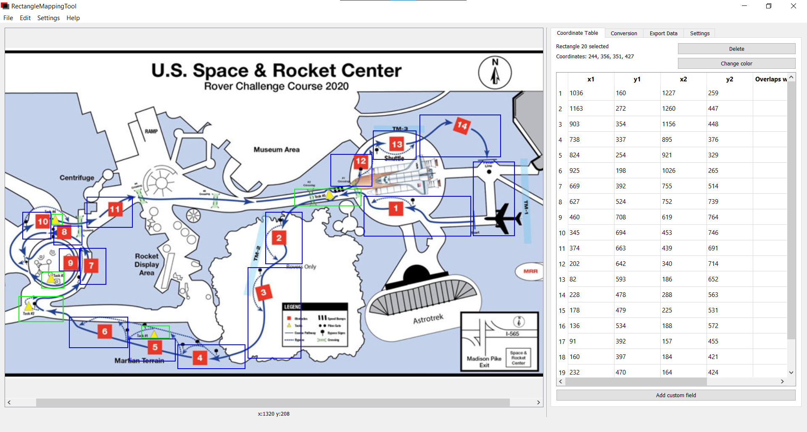

Its intended purpose for the AACT Telemetry project is to simplify the creation of rectangular bounding regions from the [HERC course map](https://www.nasa.gov/sites/default/files/atoms/files/edu_herc-map-2020.pdf). With it, we can easily create non-overlapping regions for each obstacle and task, giving us insight on what tasks take the longest, are point-inefficient, and so on. The conversion and export functionality of the program makes defining the equivalent GPS coordinates much easier and gives us flexibility on what we can do with the data.

- [RectangleMappingTool](#rectanglemappingtool)
  - [Installation](#installation)
    - [Windows](#windows)
    - [Everywhere else](#everywhere-else)
  - [Features](#features)
    - [Rectangle drawing/artistic expression](#rectangle-drawingartistic-expression)
    - [Data representation](#data-representation)
    - [Coordinate conversion](#coordinate-conversion)
    - [Overlap detection](#overlap-detection)
    - [CSV export](#csv-export)
      - [Simple export](#simple-export)
      - [Advanced export](#advanced-export)
      - [Additional info](#additional-info)
    - [F-string (like) export](#f-string-like-export)
    - [Customizability](#customizability)
  - [A brief tutorial](#a-brief-tutorial)
  - [What's next?](#whats-next)
  - [Packaging](#packaging)
    - [On Python 3.8](#on-python-38)
    - [On Python 3.6+](#on-python-36)
  - [BSD license reproduction](#bsd-license-reproduction)
  - [Endnote](#endnote)

## Installation

### Windows
Click on [Releases](https://github.com/aacttelemetry/RectangleMappingTool/releases) for an installer of the latest version. **Do heed the warnings** - check that the install directory is exactly where you want it to be. That means clicking on "Browse" when it prompts you for the install directory and explicitly clicking on your target install location.

I'm not sure how unlucky I was when it decided (and I let it) write 6 million files totalling over 10 GB, with the installer seeming to uninstall one of my Autodesk programs and my Git settings with it...

### Everywhere else
Building on any other platform requires that you build from source, since fbs will only build an installer for the platform of the current computer - I currently only have access to a Windows installation.

This project was written with Python 3.8; however, Python 3.6+ should work (if not better than on Python 3.8 with regards to building the installer).

There are only two Python dependencies for running the app:
- PyQt5
- fbs

Clone this repo to your working directory. In the terminal of your choice, execute `fbs run`. This should open the application.

If you choose to create a virtual environment with these two dependencies installed, ensure that you have activated the virtual environment beforehand.

Please note that `drawex.py` (the original Scribble example) and `main copy.py` can be deleted - they are reference files that were not removed during development.

## Features

Note that for almost all illustrations below, the default pen width has been set to 2px for visibility. The internal/factory default is 1px.

### Rectangle drawing/artistic expression
The core feature of RectangleMappingTool - referred to as RMT from here onward - is the ability to draw rectangles (on top of an image, if you'd like).

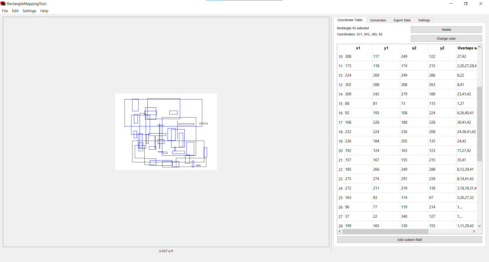


### Data representation

Really, you could do the drawing part much more easily in a regular graphics program (particularly an SVG editor, where rectangles and their coordinates are obviously defined and can easily be parsed out). However, it takes additional effort to actually view such data, and it can't easily be done in real-time. This is the primary reason RMT was created - to make the data processing more direct and oriented around rectangle drawing. 

(Actually, it was because my Google searches of "rectangle drawing tool" and "coordinate mapper" and "bounding region drawer" returned either nothing useful or relatively restrictive tools that didn't fit my needs.)

RMT gives you a table and other information that updates in real-time to make precise measurements and change them down to the pixel:

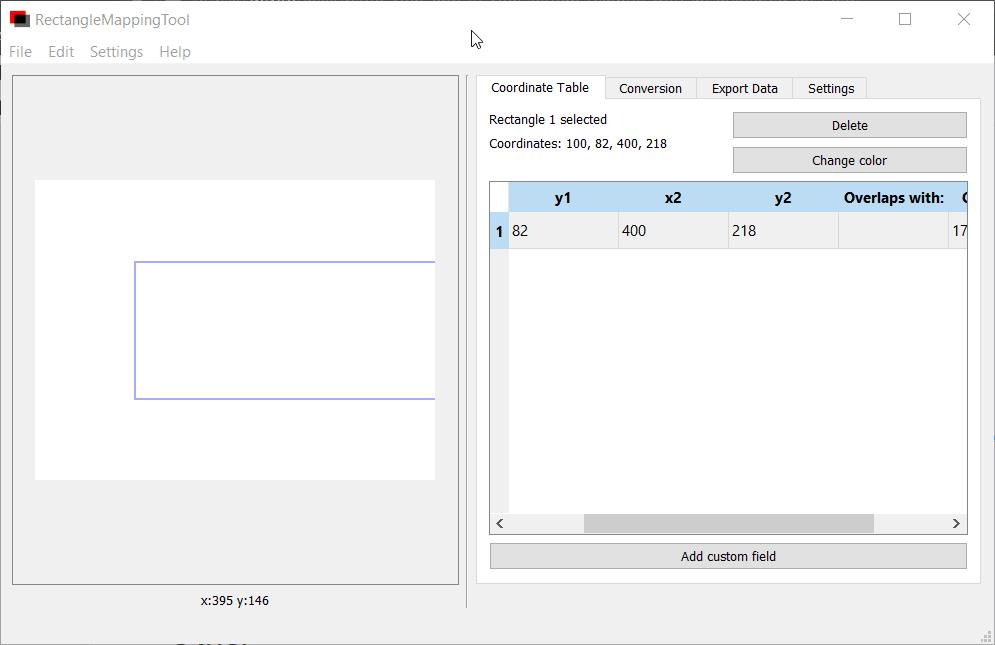

You can also create custom fields for labelling each rectangle, which can also be used as an export field when exporting data:

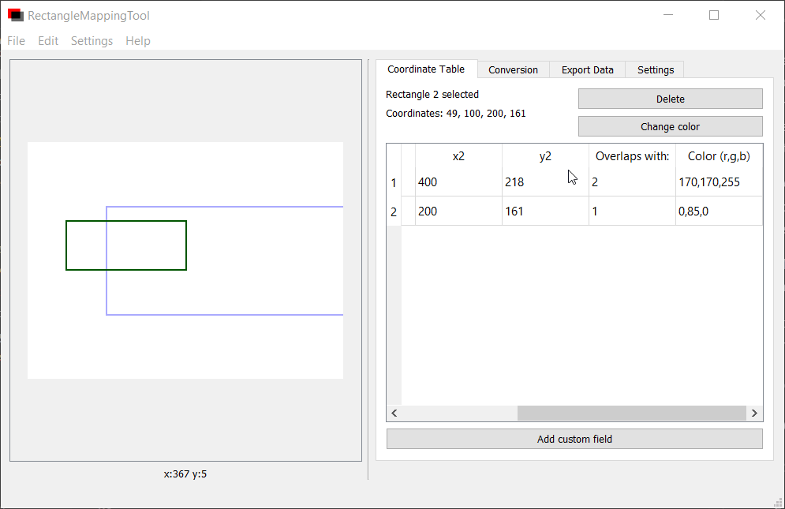

And, as shown here, you can change the appearance of individual rectangles and delete them by selecting them from the table:

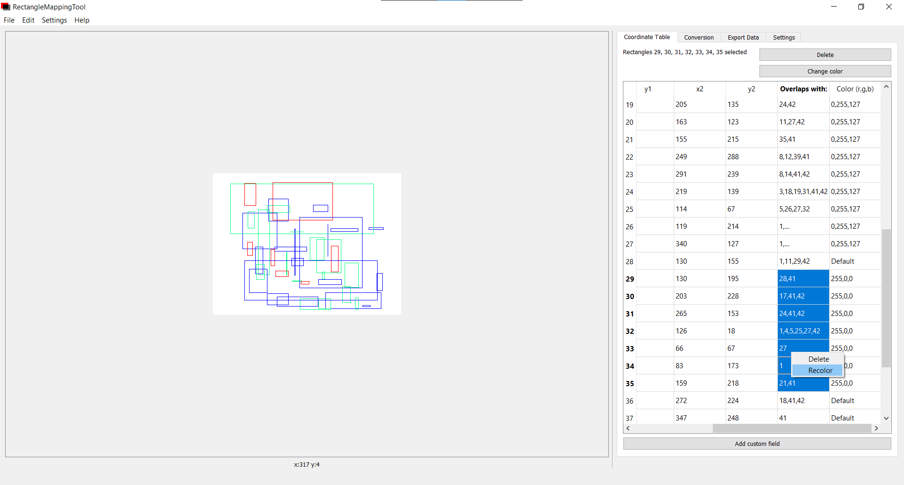

The custom context menu (what shows up when you right-click a row on the table) is redundant and there for convenience; you can also click on the "Delete" and "Change color" buttons at the top to do the same thing.

### Coordinate conversion

RMT takes out the legwork of trying to convert these rectangles into GPS coordinates by doing the math for you:

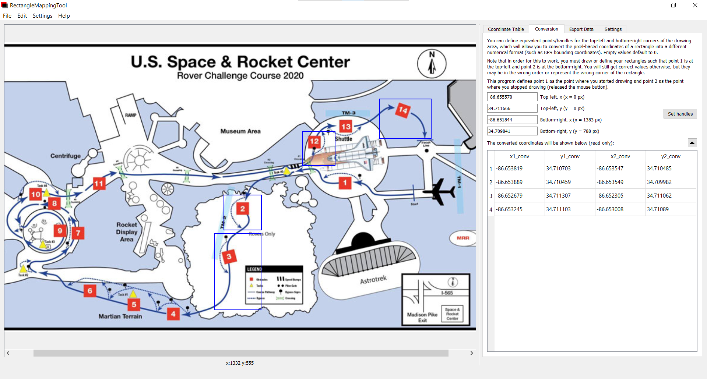

Simply give it four coordinates - the first two representing the equivalent point of the top-left of the image, and the second two representing the bottom-right of the image - and it'll automatically spit out the respective values.

While it can be a little picky at times, it is pretty accurate given that you are actually working at or near 1:1 ratio. You can then export these converted values to a CSV or .txt file, as shown later.

### Overlap detection

RMT can calculate if rectangles overlap or not, noting in the coordinate table what rectangles a certain rectangle overlaps with. This can help you avoid defining two regions for the same coordinate, which can have unexpected consequences depending on your usage of the data.

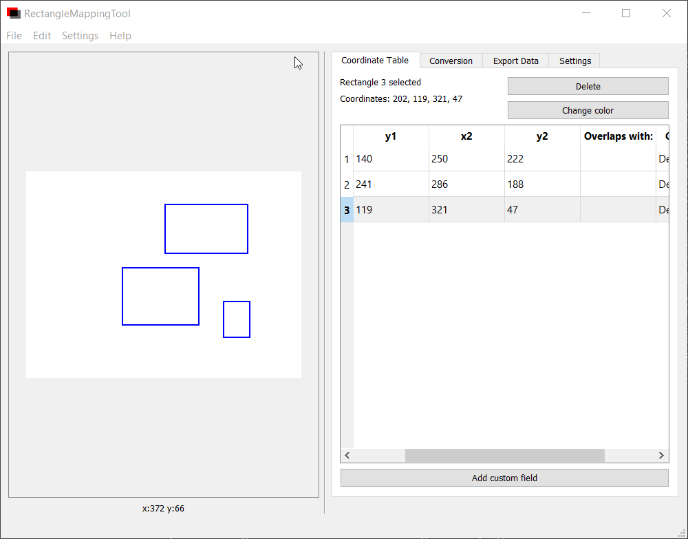

Note that this is executed on each completed rectangle - if you find that this is insanely resource computing, you may want to disable the associated setting.

### CSV export

RMT can export all data displayed in its tables to a CSV file, including custom fields, color, and overlap information. The available fields are based on the columns present in the tables. (Note that if you have not defined conversion handles, they will not be available for export.)

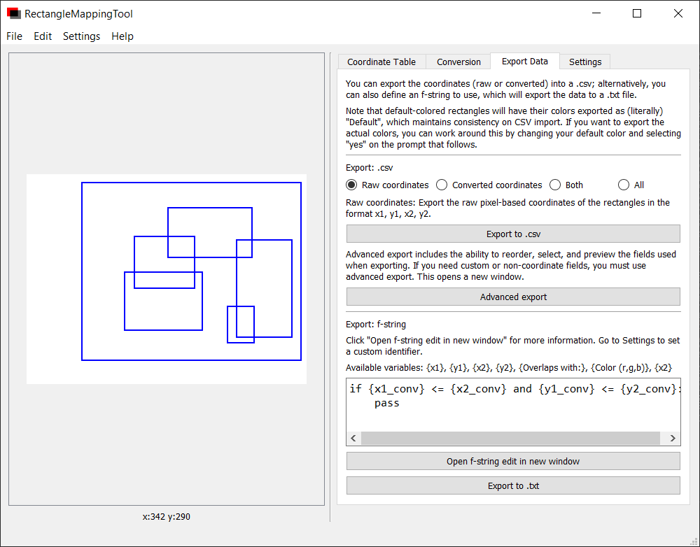

#### Simple export

The inline CSV exporter allows you to quickly save the table data you choose.

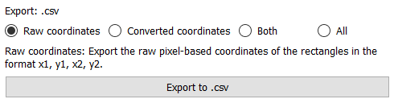

The options are as follows:
- `Raw coordinates`: Export the raw pixel-based coordinates of the rectangles in the format x1, y1, x2, y2.
- `Converted coordinates`: Export the converted coordinates of the rectangles in the format x1_conv, y1_conv, x2_conv, y2_conv.
- `Both`: Export both raw and converted coordinates in the format x1, y1, x2, y2, x1_conv, y1_conv, x2_conv, y2_conv.
- `All`: Export every valid field, including custom fields, color, and overlaps if enabled in the format raw coordinates, other fields, converted coordinates. (That is, x1, y1, x2, y2, custom fields, ... , x1_conv, y1_conv, x2_conv, y2_conv.)

(And yes, these are almost verbatim from the program, but they're here anyways.)
#### Advanced export

You can also click on `Advanced export` to open a new window that will allow you to reorder and choose what fields you'd like to export by dragging and dropping the list elements:

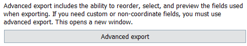

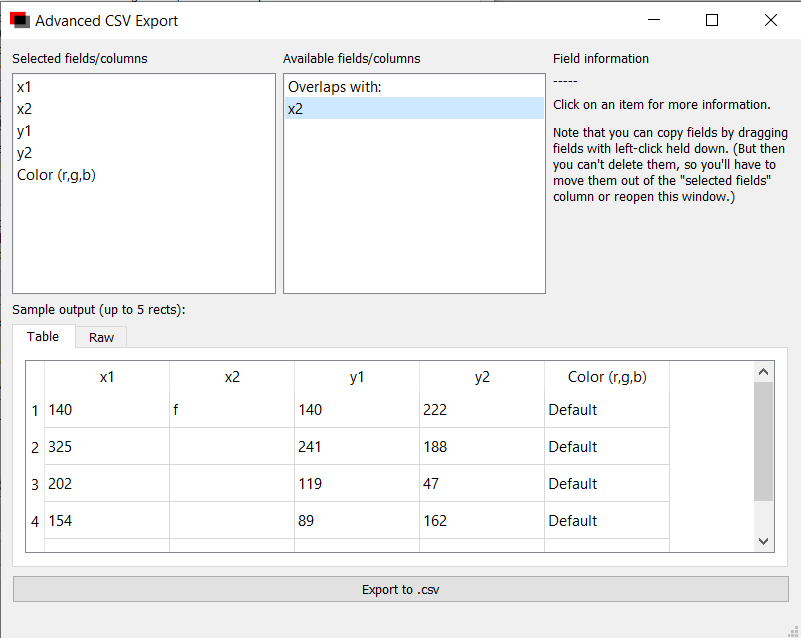

Also available is a sample of the CSV output (of up to five rows of data), represented either in a table or as the raw text that will be written to the CSV file.

#### Additional info

Do note that you should avoid naming custom fields the same as built-in fields; this will likely cause all references to the built-in field to be replaced by the data of your custom field instead.

This function uses Python's built-in CSV library with the default settings for writing, with the exception of newline - there is no extra whitespace between each entry. The following settings are used:
- newline = ''
- mode = 'w' 
- delimeter = ","
- quotechar = '"'
- and any other standard settings.

You can also import coordinates and colors from a CSV file in the format `x1, y1, x2, y2, (ignored), color` - all coordinates are assumed to be pixel coordinates and are converted to `int`; colors are expected to be in the format `(r,g,b)` or say `Default`. Fields after color are ignored.

As implied by the inflexibility of the import function, it's really only meant to redraw rectangles already drawn by this program - this allows you to come back to a drawing and work on it later. In the future, perhaps it will figure out where `x1` is even if it's not the first field, or calculate the original conversion handles if `x1_conv` and its brothers are present. Right now, however, it's very basic and thus has little documentation devoted to it.

### F-string (like) export

The endgoal of this program for the AACT Telemetry project is to produce code that acts on where the vehicle currently is. RMT's f-string export allows us to rapidly create such code for each rectangle, replacing variable names with that rectangle's respective values *as if* it were a Python f-string.

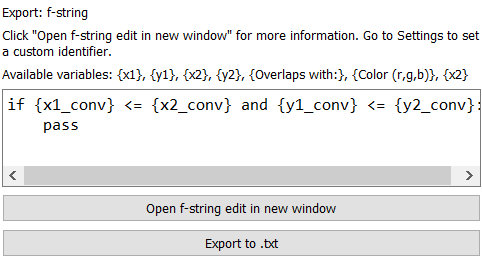

For example, if I had the custom field `Caption` and in it were descriptions of each of the bounding regions, I could use this feature to turn this:

```
if {x1_conv} <= x <= {x2_conv} and {y1_conv} <= y <= {y2_conv}:
  print({Caption})
```

into something like this for each rectangle:

```
if -86.652779 <= x <= -86.652264 and 34.711295 <= y <= 34.711066:
  print("You are probably at the start or finish line!")
```

That said, it can be inflexible and a pain to use, in which case exporting these coordinates to a CSV file and throwing it into Excel or something can be a better option.

While this is very much like the f-string format that Python uses, it is actually just a glorified find+replace internally; this is why custom identifiers (characters at the start and end of each variable) can be defined, as shown below.

### Customizability

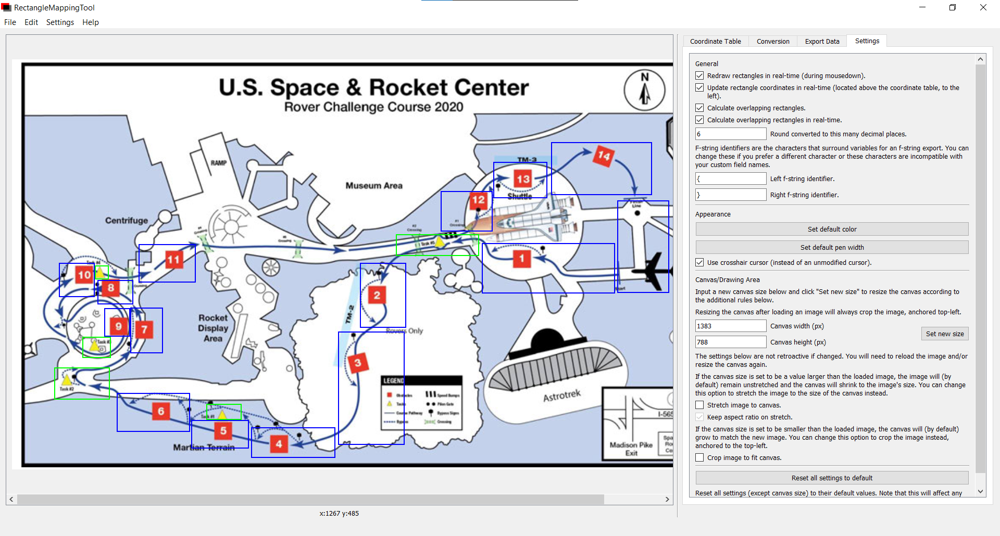

You can define a variety of settings that (may or may not) improve performance as well as the appearance of objects. These are listed below in order, from top to bottom:
- General
  - You can choose whether or not you want to actively show the rectangle you are currently drawing. If disabled, you will have no feedback on the starting point or shape of a rectangle you are drawing until you release the left mouse button.
    - The reason this is an option at all is because the entire canvas is redrawn each time you move your mouse while holding the left mouse button; that is, it doesn't just erase and redraw the rectangle you're drawing right now, but it redraws *every* rectangle. This can be performance-taxing, and unfortunately this probably won't be fixed for a while.
  - You can choose whether or not you want the coordinates of the rectangle you're currently drawing will be shown to the left of the `Delete` and `Change color` buttons on the Coordinate Table tab.
  - You can choose whether or not you want the program to go through the effort of figuring out what rectangles overlap with each other or not.
  - Real-time overlap calculation actually does nothing at the moment, but it *should* update the table in real-time with what overlaps and what doesn't. This was dropped on the grounds of "you don't need it, just change the coordinates after you draw them," but it might work in the future. It is very performance taxing.
  - You can select the precision of values shown in the table on the Conversion tab. This simply changes `n` for `round(value, n)` on each cell in the table.
  - You can change the f-string identifying characters, in the event you are working with incompatible characters or have some other preference for defining placeholder variables. For example, changing them from `{}` to `<]` would require that `x1` be written as `<x1]`. 
- Appearance
  - You can change the default color of the rectangles you draw. RMT's internal system defines rectangles that have not had their colors explicitly changed by the user as the color "Default". What this means is that these rectangles will all change color if you change the default color; however, you can choose to keep them the old default color if you choose "Yes" at the dialog that pops up when changing this setting.
  - You can change the width of the lines that make up the rectangles. Internally, this does nothing to their coordinates; however, due to how Qt draws rectangles, you may find that some rectangles appear off. See [the documentation page for QRect](https://doc.qt.io/qt-5/qrect.html) for more information.
  - You can change whether or not you have a crosshair cursor instead of a regular cursor when hovering over the canvas.
- Canvas/Drawing Area
  - You can change the current size of the canvas. How loaded images behave when you retroactively or proactively change the size of the image is determined by the settings below.
  - By default, if the canvas is larger than the image loaded, the canvas will shrink to the size of the loaded image. You can change it so that the smaller loaded image will instead grow to the size of the larger canvas.
    - You can also change whether or not to maintain the aspect ratio of the image if this occurs. If enabled, then the image will grow to as large as it can while preserving its aspect ratio. The canvas **will not** resize itself to remove the remaining whitespace; you will need to resize it yourself if you want to remove the whitespace.
  - By default, if the canvas is smaller than the image loaded, the canvas will grow to the size of the loaded image. You can change it so that the larger loaded image will be cropped, anchored to the top-left; the size of the canvas will not change.
    - Note that this means you cannot easily "downsize" an image while preserving aspect ratio using RMT.

Finally, you can reset the above settings to the internal default. These settings are defined in [default.json](src\main\resources\base\default.json).

Defaults:
- Redraw rectangles in real time.
- Update coordinates in real time.
- Calculate overlapping rectangles after mouse release.
- **Do not** calculate overlapping rectangles in real time.
- Round converted values to six decimal places.
- Default identifiers are `{` and `}`.
- The default color is blue (0, 0, 255).
- The default pen width is 1px.
- Crosshair cursor on canvas enabled.
- Crop large images/stretch small images disabled.

Note that there is an unused setting `max_undo_actions`, which was intended to cap the amount of actions that could be undone via the undo function. As of now, undo simply deletes the most recently drawn rectangle.

## A brief tutorial

This will show you how to use basic features of RMT.

## What's next?
As of August 2020, RMT runs on a single Python file (importing three different pyuic-generated .ui files). It's pretty clear that it wasn't designed with another developer in mind, and the current processes for generating the table, calculating/returning overlapping rectangles, and drawing the canvas are resource-taxing due to their redundant nature. Furthermore, there is little separation of business logic and the UI, making it incredibly difficult to maintain and extend. Future development should focus on separating these concerns and reducing ambiguity throughout the code (and attempt to find a fix for the rather taxing methods used for core functionality.)

See [Issues](https://github.com/aacttelemetry/RectangleMappingTool/issues) for planned development (which may or may not happen). It outlines other issues that currently exist within the program as well as planned feature additions.

It wasn't until the final days of this project that I started looking into PyQt best practices - it finally occurred to me that *"oh, maybe having 40 methods of varying purpose and size isn't a great idea."* In other words, the code sucks.

Also it doesn't conform to PEP conventions. That'll be fixed as well someday, when I (or, someone else) comes back to this project.

## Packaging

### On Python 3.8
In order to generate an installer for RMT on Python 3.8, a great deal of duct tape is required. PyInstaller is a requirement of fbs, but the public release does not currently support Python 3.8. However, PyInstaller 4.0.dev0 *does* support Python 3.8.

1. Clone the latest [fbs repo](https://github.com/mherrmann/fbs).
2. In `requirements.txt`, remove `PyInstaller==3.4`.
3. In `setup.py`, remove `install_requires=['PyInstaller==3.4']`.
4. Install this modified version of fbs to a virtual environment (activate it, then navigate to `fbs-x.x.x`; there, run `pip install .`).
5. Install PyInstaller with `pip install https://github.com/pyinstaller/pyinstaller/archive/develop.tar.gz`.

This should resolve any problems executing `pip freeze` or `pip installer` on Python 3.8.

### On Python 3.6+
By default, fbs will install `PyInstaller==3.4`. As of writing, fbs supports Python 3.5 and 3.6; however, the use of f-strings in this program makes 3.5 unusable. You can edit `main.py` to make it 3.5-compatible. 

I have not attempted to generate an installer or run RMT on Python 3.5+, but it should otherwise work. You may have to resolve issues on Python 3.7.

## BSD license reproduction
*This program is a modified version of the PyQt Scribble example. As such, the following notice has been reproduced:*

Copyright (C) 2013 Riverbank Computing Limited.
Copyright (C) 2010 Nokia Corporation and/or its subsidiary(-ies).
All rights reserved.

This file is part of the examples of PyQt.

$QT_BEGIN_LICENSE:BSD$
You may use this file under the terms of the BSD license as follows:

"Redistribution and use in source and binary forms, with or without
modification, are permitted provided that the following conditions are
met:
- Redistributions of source code must retain the above copyright
notice, this list of conditions and the following disclaimer.
- Redistributions in binary form must reproduce the above copyright
notice, this list of conditions and the following disclaimer in
the documentation and/or other materials provided with the
distribution.
- Neither the name of Nokia Corporation and its Subsidiary(-ies) nor
the names of its contributors may be used to endorse or promote
products derived from this software without specific prior written
permission.

THIS SOFTWARE IS PROVIDED BY THE COPYRIGHT HOLDERS AND CONTRIBUTORS
"AS IS" AND ANY EXPRESS OR IMPLIED WARRANTIES, INCLUDING, BUT NOT
LIMITED TO, THE IMPLIED WARRANTIES OF MERCHANTABILITY AND FITNESS FOR
A PARTICULAR PURPOSE ARE DISCLAIMED. IN NO EVENT SHALL THE COPYRIGHT
OWNER OR CONTRIBUTORS BE LIABLE FOR ANY DIRECT, INDIRECT, INCIDENTAL,
SPECIAL, EXEMPLARY, OR CONSEQUENTIAL DAMAGES (INCLUDING, BUT NOT
LIMITED TO, PROCUREMENT OF SUBSTITUTE GOODS OR SERVICES; LOSS OF USE,
DATA, OR PROFITS; OR BUSINESS INTERRUPTION) HOWEVER CAUSED AND ON ANY
THEORY OF LIABILITY, WHETHER IN CONTRACT, STRICT LIABILITY, OR TORT
(INCLUDING NEGLIGENCE OR OTHERWISE) ARISING IN ANY WAY OUT OF THE USE
OF THIS SOFTWARE, EVEN IF ADVISED OF THE POSSIBILITY OF SUCH DAMAGE."
$QT_END_LICENSE$

## Endnote
Thanks to:
- Michael Herrmann for creating fbs and making this project remotely possible;
- the developers of and contributors to PyQt;
- the Qt docs for making this not impossible;
- and the countless Stack Overflow and Qt Forum posts referenced throughout the code. Wouldn't have even tried if Stack Overflow wasn't a thing.

Said posts are listed below:
- https://stackoverflow.com/questions/3615125/should-wildcard-import-be-avoided
- https://stackoverflow.com/questions/37621753/how-validate-a-cell-in-qtablewidget
- https://stackoverflow.com/questions/7010611/how-can-i-crop-an-image-in-qt
- https://stackoverflow.com/questions/37621753/how-validate-a-cell-in-qtablewidget
- https://forum.qt.io/topic/81918/qtableview-cell-validation-specific-validator-for-a-column/3
- https://stackoverflow.com/questions/35185113/configure-qtwidgets.qwidget-to-fill-parent-via-layouts
- https://stackoverflow.com/questions/8381735/how-to-toggle-a-value-in-python
- https://stackoverflow.com/questions/3941517/converting-list-to-args-when-calling-function
- https://stackoverflow.com/questions/33744111/how-to-set-qtreewidgetitem-as-not-editable
- https://stackoverflow.com/questions/3077192/get-a-layouts-widgets-in-pyqt
- https://stackoverflow.com/questions/36614635/pyqt-right-click-menu-for-qcombobox
- https://stackoverflow.com/questions/5927499/how-to-get-selected-rows-in-qtableview
- https://stackoverflow.com/questions/3940128/how-can-i-reverse-a-list-in-python
- https://stackoverflow.com/questions/44471380/surround-strings-in-an-array-with-a-certain-character
- https://stackoverflow.com/questions/44778/how-would-you-make-a-comma-separated-string-from-a-list-of-strings
- https://stackoverflow.com/questions/57663191/how-to-convert-a-qbytearray-to-a-python-string-in-pyside2
- https://stackoverflow.com/questions/37411750/pyqt-qdialog-return-response-yes-or-no

Also thanks to the Academy of Arts, Careers, and Technology for supporting my ambitions in making a half-decent telemetry system (´・◡・｀)